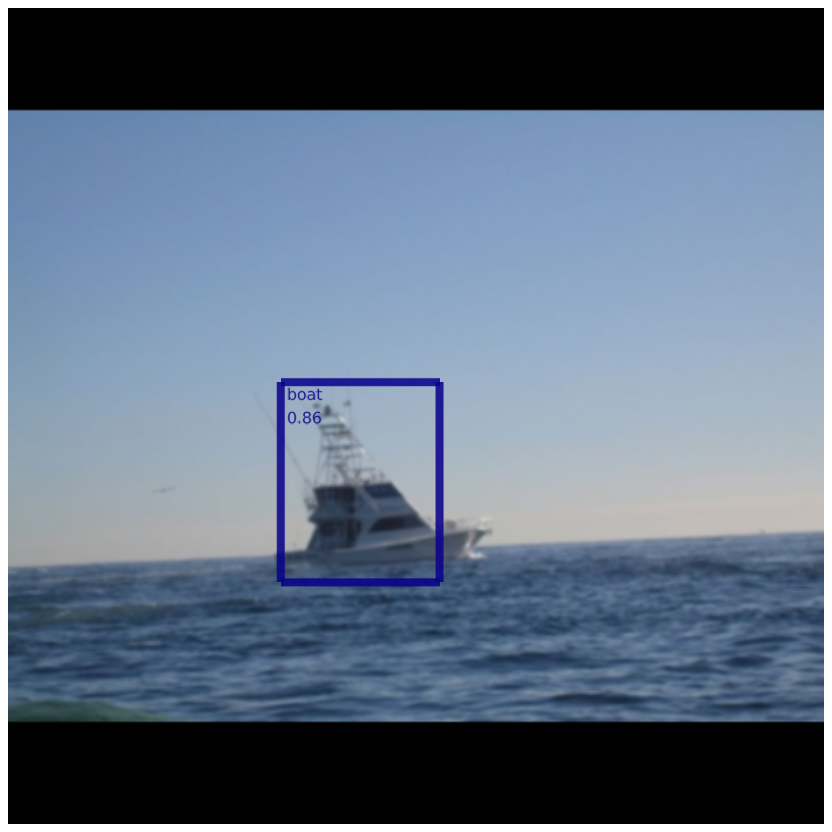
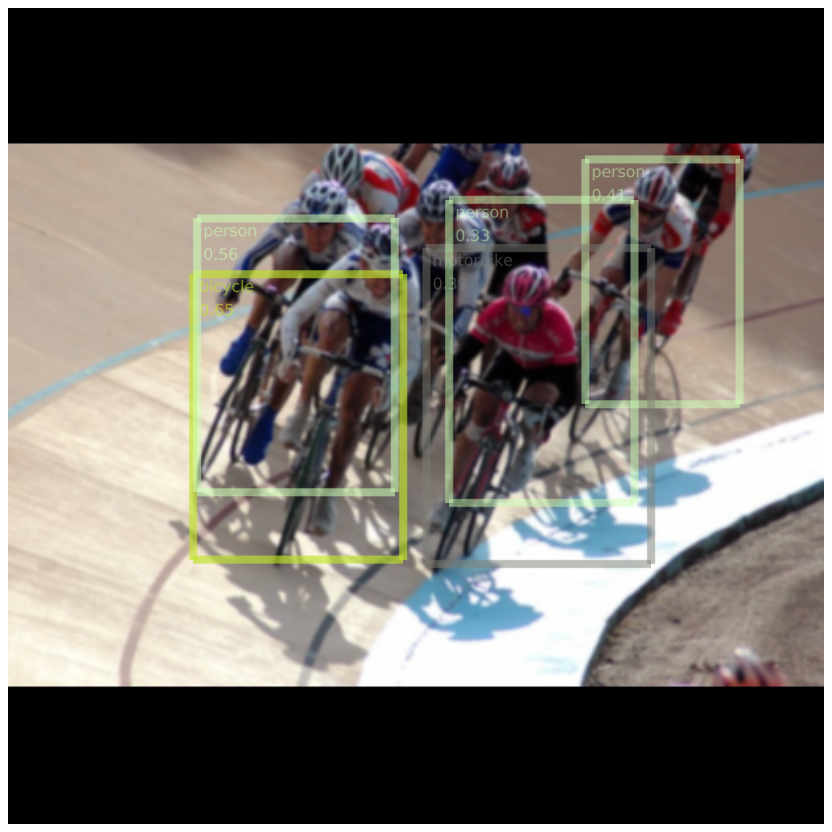
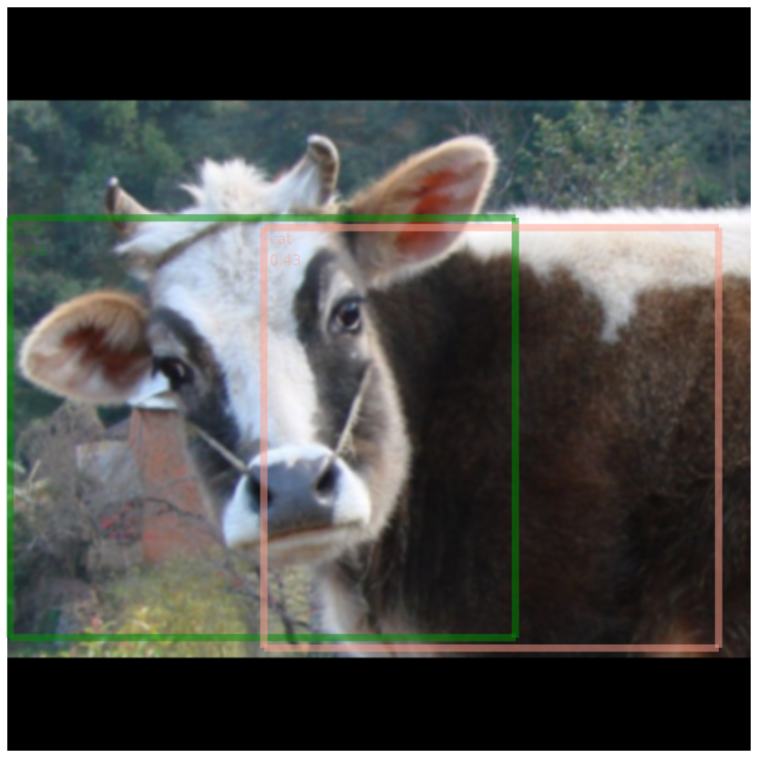
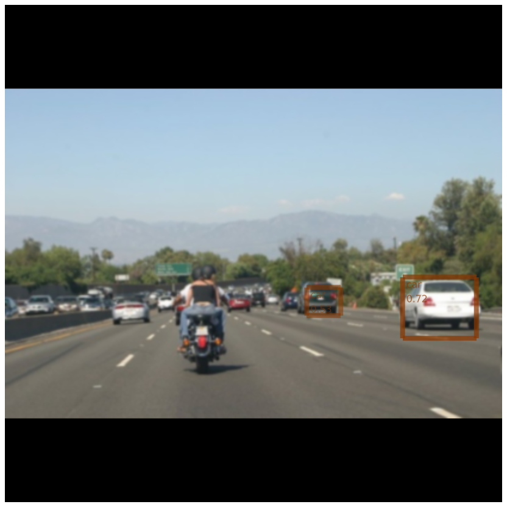

# YOLO.jl
# Forked from https://github.com/ianshmean/YOLO.jl
Full credits go to https://github.com/ianshmean and https://github.com/Ybakman. This copy is used for experimenting with YOLOv2 reorg and concat layers, as well as loss function definition.

* Loading YOLOV2-VOC (https://github.com/pjreddie/darknet/blob/master/cfg/yolov2-voc.cfg) is now possible.
Currently only supports loading [YOLOv2-tiny](https://github.com/pjreddie/darknet/blob/master/cfg/yolov2-tiny.cfg) and the [VOC-2007](http://host.robots.ox.ac.uk/pascal/VOC/voc2007/) pretrained model (pretrained on [Darknet](https://pjreddie.com/darknet/)).

The majority of this is made possible by Yavuz Bakman's great work in https://github.com/Ybakman/YoloV2

<p float="left">




</p>

See below for examples or ask questions on [](https://slackinvite.julialang.org)

| **Platform**                                                               | **Build Status**                                                                                |
|:-------------------------------------------------------------------------------:|:-----------------------------------------------------------------------------------------------:|
| Linux & MacOS x86 | [![][travis-img]][travis-url] |
| Windows 32/64-bit | [![][appveyor-img]][appveyor-url] |
| Linux ARM 32/64-bit | [![][drone-img]][drone-url] |
| FreeBSD x86 | [![][cirrus-img]][cirrus-url] |
|  | [![Codecoverage Status][codecov-img]][codecov-url]<br>[![Coveralls Status][coveralls-img]][coveralls-url] |


## Installation

The package can be installed with the Julia package manager.
From the Julia REPL, type `]` to enter the Pkg REPL mode and run:

```
pkg> add YOLO
```
If you have a CUDA-supported graphics card, make sure that you have CUDA set up such that it satisfies [CUDAapi.jl](https://github.com/JuliaGPU/CUDAapi.jl) or [CuArrays.jl](https://github.com/JuliaGPU/CuArrays.jl) builds.

If you just want to run on CPU (or on a GPU-less CI instance) Knet.jl is currently dependent on a system compiler for the GPU-less conv layer, so make sure you have a compiler installed: i.e. ```apt-get update && apt-get install gcc g++``` for linux or install visual studio for windows

## Example Usage (WIP)

### Testing a dataset
```julia
using YOLO

#First time only (downloads 5011 images & labels!)
YOLO.download_dataset("voc2007")

# V2_tiny
settings = YOLO.pretrained.v2_tiny_voc.load(minibatch_size=1) #run 1 image at a time
model = YOLO.v2_tiny.load(settings)
YOLO.loadWeights!(model, settings)

# V2
settings = YOLO.pretrained.v2_voc.load(minibatch_size=1)
model = YOLO.v2.load(settings)
nr_constants = 5 # nr of constants at the beginning of weights file
YOLO.loadWeights!(model, settings, nr_constants)

voc = YOLO.datasets.VOC.populate()
vocloaded = YOLO.load(voc, settings, indexes = [100]) #load image #100 (a single image)

#Run the model
res = model(vocloaded.imstack_mat);

#Convert the output into readable predictions
predictions = YOLO.postprocess(res, settings, conf_thresh = 0.3, iou_thresh = 0.3)
```

### Testing a single custom image
To pass an image through, the image needs to be loaded, and scaled to the appropriate input size.
For YOLOv2-tiny and YOLOv2 that would be `(w, h, color_channels, minibatch_size) == (416, 416, 3, 1)`.

`loadResizePadImageToFit` can be used to load, resize & pad the image, while maintaining aspect ratio and anti-aliasing during the resize process.
```julia
using YOLO
## Load once V2_tiny
settings = YOLO.pretrained.v2_tiny_voc.load(minibatch_size=1) #run 1 image at a time
model = YOLO.v2_tiny.load(settings)
YOLO.loadWeights!(model, settings)

## OR Load once V2
settings = YOLO.pretrained.v2_voc.load(minibatch_size=1)
model = YOLO.v2.load(settings)
nr_constants = 5 # nr of constants at the beginning of weights file
YOLO.loadWeights!(model, settings, nr_constants)

## Run for each image
imgmat = YOLO.loadResizePadImageToFit("image.jpeg", settings)
res = model(imgmat)
predictions = YOLO.postprocess(res, settings, conf_thresh = 0.3, iou_thresh = 0.3)
```

or if the image is already in memory
```
imgmat = loadResizePadImageToFit(img, settings)
res = model(imgmat)
predictions = YOLO.postprocess(res, settings, conf_thresh = 0.3, iou_thresh = 0.3)
```


### Rendering results
To render results, first load `Makie` before `YOLO` (in a fresh julia instance):
```julia
using Makie, YOLO
## Repeat all above steps to load & run the model
scene = YOLO.renderResult(vocloaded.imstack_mat[:,:,:,1], predictions, settings, save_file = "test.png")
display(scene)
```


### Testing inference speed

The package tests include a small benchmark.
A 2018 macbook pro i7. CPU-only:
```
[ Info: YOLO_v2_tiny inference time per image: 0.1313 seconds (7.62 fps)
[ Info: YOLO_v2_tiny postprocess time per image: 0.0023 seconds (444.07 fps)
[ Info: Total time per image: 0.1336 seconds (7.49 fps)
```

An i7 desktop with a GTX 1070 GPU:
```
[ Info: YOLO_v2_tiny inference time per image: 0.0039 seconds (254.79 fps)
[ Info: YOLO_v2_tiny postprocess time per image: 0.0024 seconds (425.51 fps)
[ Info: Total time per image: 0.0063 seconds (159.36 fps)
```

[discourse-tag-url]: https://discourse.julialang.org/tags/yolo

[travis-img]: https://travis-ci.com/ianshmean/YOLO.jl.svg?branch=master
[travis-url]: https://travis-ci.com/ianshmean/YOLO.jl

[appveyor-img]: https://ci.appveyor.com/api/projects/status/github/ianshmean/YOLO.jl?svg=true
[appveyor-url]: https://ci.appveyor.com/project/ianshmean/YOLO-jl

[drone-img]: https://cloud.drone.io/api/badges/ianshmean/YOLO.jl/status.svg
[drone-url]: https://cloud.drone.io/ianshmean/YOLO.jl

[cirrus-img]: https://api.cirrus-ci.com/github/ianshmean/YOLO.jl.svg
[cirrus-url]: https://cirrus-ci.com/github/ianshmean/YOLO.jl

[codecov-img]: https://codecov.io/gh/ianshmean/YOLO.jl/branch/master/graph/badge.svg
[codecov-url]: https://codecov.io/gh/ianshmean/YOLO.jl

[coveralls-img]: https://coveralls.io/repos/github/ianshmean/YOLO.jl/badge.svg?branch=master
[coveralls-url]: https://coveralls.io/github/ianshmean/YOLO.jl?branch=master

[issues-url]: https://github.com/ianshmean/YOLO.jl/issues
